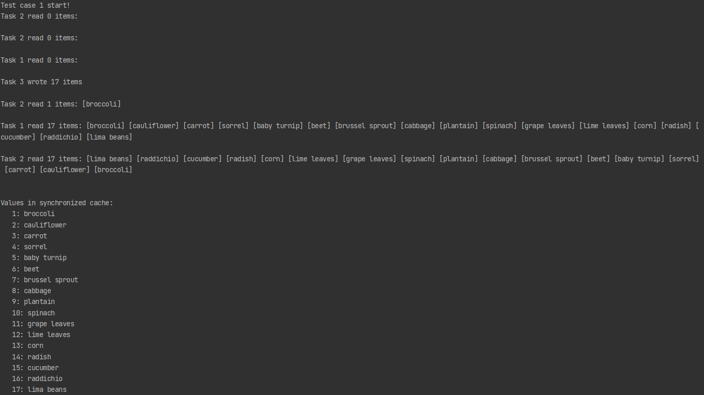
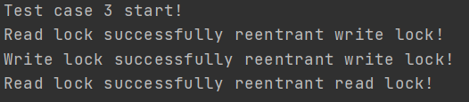
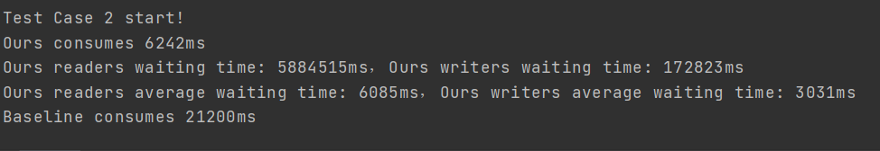

# 利用C#实现一个读写锁

|  学号   |  姓名  |
| :-----: | :----: |
| 1954098 | 香宁雨 |

## 要求

- 支持同时多个线程进行并发的读访问
- 可以支持多个线程进行写请求
- 要求不能出现写饥饿现象
- 可以使用Monitor(Enter\Exit), Event, Semphore等基本同步原语，不要使用更高级的原语

## 实现

参考https://docs.microsoft.com/en-us/dotnet/api/system.threading.readerwriterlockslim?view=net-6.0测试的实现，我们将锁的实现分为四个部分，分别为`EnterReadLock`, `ExitReadLock`, `EnterWriteLock`, `ExitWriteLock`。

普通的读写锁所使用到的数据结构如下所示

```c#
        private int readerCount;
        private int writerCount;

        private static object readerCountLock = new object();
        private static object writerCountLock = new object();

        private static object mutex = new object();

        private AutoResetEvent writeEvent;
        private AutoResetEvent readEvent;
```

- readerCount: 记录当前的读者数量
- writerCount: 记录当前的写者数量
- readerCountLock: 对读者数量进行计数时所加的锁
- writerCountLock: 对写者数量进行计数时所加的锁
- mutex: mutex保证先进行读竞争，再进行读写竞争，一定程度上保证写的优先级
- readEvent: 实现读写之间的竞争
- writeEvent: 实现读写之间的竞争

除此之外，还实现了可重入的功能，其所用到的数据结构如下所示

```c#
        private int state;
        private static object stateLock = new object();
        
		private const int SHARED_SHIFT = 16;
        private const int SHARED_UNIT = (1 << SHARED_SHIFT);
        private const int EXCLUSIVE_MASK = (1 << SHARED_SHIFT) - 1;
```

- state: 用来记录读写的重入情况，其中低16为为写重入，高16位为读重入
- stateLock: 用来对state的修改进行加锁
- SHARED_SHIFT: 记录读重入在state的位置
- SHARED_UNIT: 读重入的时候所增加的单位
- EXCLUSIVE_MASK: 获取写者数量的掩码

### EnterReadLock

```C#
        public void EnterReadLock()
        {
            int id = Environment.CurrentManagedThreadId;
            Monitor.Enter(stateLock);
            if (id == exclusiveThreadId)
            {
                state += SHARED_UNIT;
                Monitor.Exit(stateLock);
                return;
            }
            Monitor.Exit(stateLock);
            
            Monitor.Enter(mutex);
            readEvent.WaitOne();
            Monitor.Enter(readerCountLock);
            readerCount++;
            if (readerCount == 1)
            {
                writeEvent.WaitOne();
            }
            Monitor.Exit(readerCountLock);
            readEvent.Set();
            Monitor.Exit(mutex);
        }
```

重入包括读重入写，写重入写和读重入读，其中因为读可以并发，所以不需要对读重入读进行处理。在这里处理了读重入写的情况，直接给state加一个读状态即可。

mutex用于对读写竞争进行限制，读和读要先对mutex进行竞争之后才可以对控制读写竞争的readEvent进行竞争，限制了读写之间的竞争并且保证了对写的公平性。

### ExitReadLock

```c#
        public void ExitReadLock()
        {
            int id = Environment.CurrentManagedThreadId;
            Monitor.Enter(stateLock);
            if (id == exclusiveThreadId)
            {
                state -= SHARED_UNIT;
                Monitor.Exit(stateLock);
                return;
            }
            Monitor.Exit(stateLock);
            
            Monitor.Enter(readerCountLock);
            readerCount--;
            if (readerCount == 0)
            {
                writeEvent.Set();
            }
            Monitor.Exit(readerCountLock);
        }
```

EnterReadLock和ExitReadLock对于重入的操作是类似的，也是判断是否是同一线程，然后将状态进行减少并且使用锁进行控制。在读的readerCount为0时，意味着现在已经没有读者在读了，可以让写者进行写了，所以使用writeEvent.Set()方法。

### EnterWriteLock

```c#
public void EnterWriteLock()
{
    int id = Environment.CurrentManagedThreadId;
    Monitor.Enter(stateLock);
    int r = readersSharedCount(state);
    int w = writersSharedCount(state);
    if (w != 0 && id == exclusiveThreadId)
    {
        if (r != 0)
        {
            throw new Exception("Write lock cannot reentrant read lock");
        }
        state += 1;
        Monitor.Exit(stateLock);
        return;
    }
    Monitor.Exit(stateLock);
    
    Monitor.Enter(writerCountLock);
    writerCount++;
    if (writerCount == 1)
    {
        readEvent.WaitOne();
    }
    Monitor.Exit(writerCountLock);
    writeEvent.WaitOne();
    
    Monitor.Enter(stateLock);
    exclusiveThreadId = Environment.CurrentManagedThreadId;
    state += 1;
    Monitor.Exit(stateLock);
}
```

对于每个写而言，都是独占线程，所以将这个独占线程的id记录下来，并且对state+1，代表现在有一个进程在写，之后可以进行读重入和写重入。

首先记录当前的重入读和重入写有几个，如果已经在写了并且重入读不为0时，不可以进行重入写操作。在进行写操作计数的时候需要将readEvent设置为阻塞，阻止之后其他线程的读操作，同时因为写之间是互斥的，所以writeEvent也需要阻塞。

### ExitWriteLock

```c#
        public void ExitWriteLock()
        {
            int id = Environment.CurrentManagedThreadId;
            Monitor.Enter(stateLock);
            state -= 1;
            if (state != 0)
            {
                Monitor.Exit(stateLock);
                return;
            }
            exclusiveThreadId = -1;
            Monitor.Exit(stateLock);

            writeEvent.Set();
            Monitor.Enter(writerCountLock);
            writerCount--;
            if (writerCount == 0)
            {
                readEvent.Set();
            }
            Monitor.Exit(writerCountLock);
        }
```

退出写锁的状态和推出读锁的状态类似，都是先将state减去相应的单位，然后释放读事件，使writeEvent不被阻塞，然后将writeCount的数量减少，如果writeCount为0时，可以进行读。

## 测试



使用官网对于读写锁的测试，可以看到测试结果和结果需求相同。



因为官网的示例标明了因为没有对参数进行设置所以不支持对于递归调用的重入测试，所以对可重入性进行测试，如上图所示，可以看到都成功了。其中读重入读为并行。

## 性能

- baseline：只使用一个Monitor
- 读写者线程总数：1024个
- 假设：读取时间10ms，写入时间100ms
- 写者比例5%



写者平均等待时间：大约是 Baseline方法（只使用一个Monitor）的 71倍

读者平均等待时间：大约是 Baseline方法（只使用一个Monitor）的 30倍

写者比例越低时，与Baseline 相比优化效果越好。
